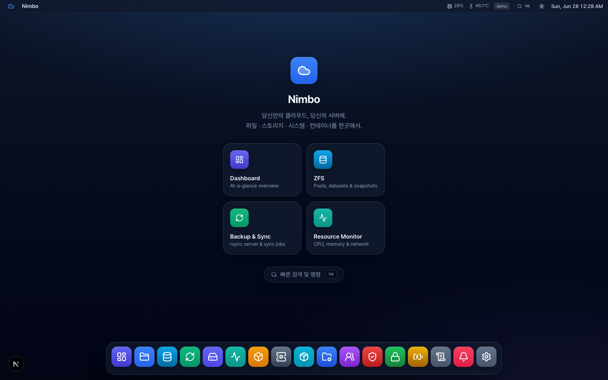
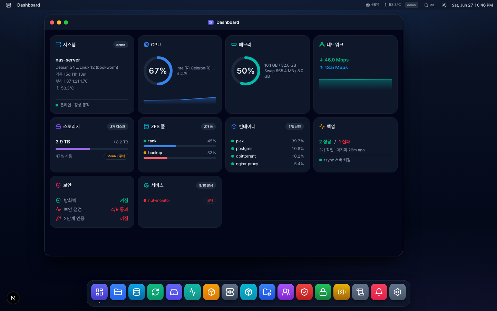
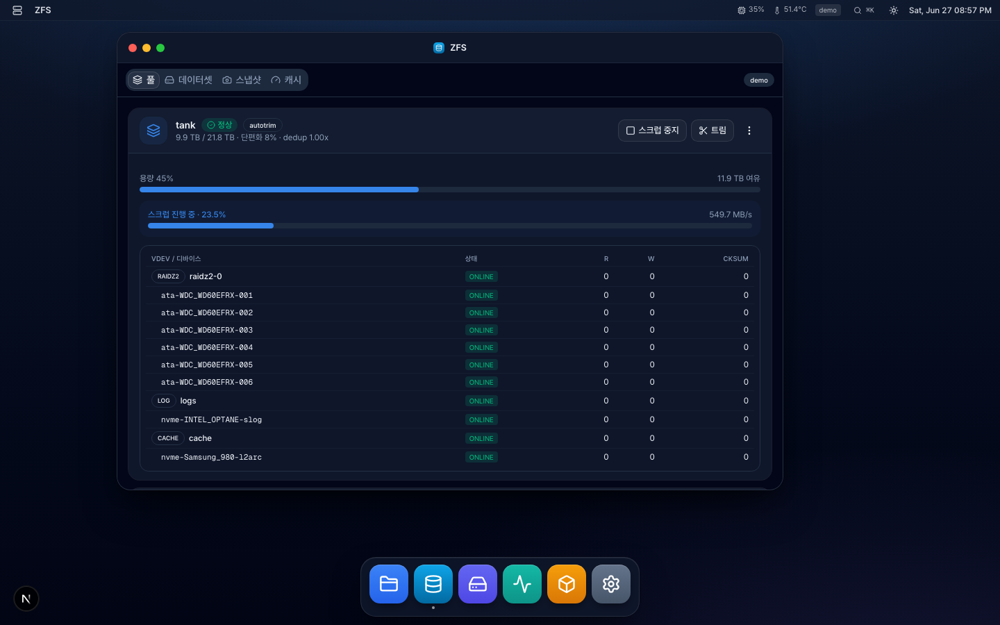
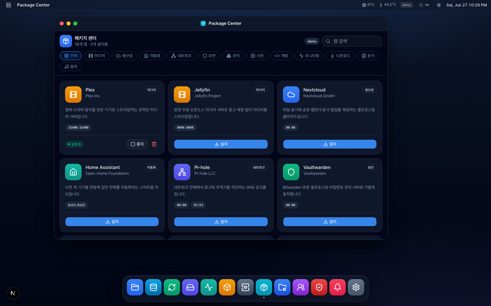
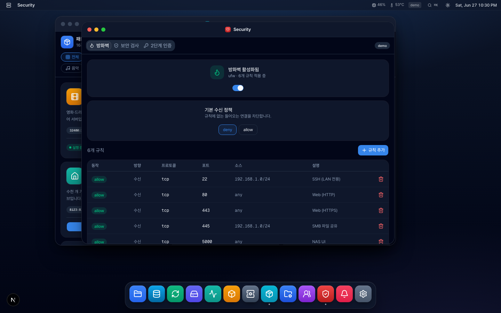

<p align="center"></p>

<h1 align="center">Nimbo</h1>

<p align="center"><strong>Your own cloud, self-hosted.</strong><br>당신만의 클라우드, 당신의 서버에.</p>

<p align="center">
  <a href="https://seongilp.github.io/nimbo/"><strong>🌐 Website / 소개 페이지</strong></a>
  &nbsp;·&nbsp;
  <a href="INSTALL.md">📦 설치 가이드</a>
  &nbsp;·&nbsp;
  <a href="MANUAL.md">📖 사용 매뉴얼</a>
  &nbsp;·&nbsp;
  <a href="DEPLOYMENT.md">🚀 배포 가이드</a>
  &nbsp;·&nbsp;
  <a href="SECURITY.md">🔒 보안</a>
  &nbsp;·&nbsp;
  <a href="PRIVACY.md">🛡️ 개인정보처리방침</a>
  &nbsp;·&nbsp;
  <a href="https://fairy.hada.io/@lumen">❤️ 후원 / Sponsor</a>
</p>

<p align="center"><code>curl -fsSL https://raw.githubusercontent.com/seongilp/nimbo/main/deploy/bootstrap.sh | sudo bash</code></p>

<p align="center">
  
  
  
  
  
  <a href="https://fairy.hada.io/@lumen"></a>
</p>

<p align="center"></p>

Nimbo is a Synology DSM-style web console to manage a Linux server like a NAS. It
renders a desktop-in-the-browser: a wallpaper, a top taskbar, an app launcher,
and draggable/resizable windows. Each "app" is a window.

> A polished marketing landing page lives at the **`/landing`** route
> (`src/app/landing/page.tsx`).

Built with Next.js (App Router) + TypeScript + Tailwind + shadcn/ui + lucide-react.

## Features

- 🖥️ **데스크톱 UI** — macOS 스타일 윈도우 · 도크 · ⌘K 커맨드 팔레트
- 🗄️ **ZFS 관리** — 풀 · 데이터셋 · 스냅샷 · 복제
- 💾 **백업 & 동기화** — rsync · rclone 클라우드 · Time Machine
- 📦 **컨테이너 & 패키지 센터** — Docker 제어 + 원클릭 셀프호스팅 앱
- 🛡️ **보안** — 방화벽 · 2FA · 감사 로그
- 👥 **사용자 / 공유폴더** — 계정 권한 + Samba · NFS 공유
- 📊 **모니터링 대시보드** — CPU · 메모리 · 네트워크 · 스토리지 실시간
- 🔒 **HTTPS / 인증서** — Caddy 리버스 프록시 자동 TLS
- 🔌 **UPS / SNMP** 모니터링 · 🔔 **알림** (Slack / Telegram / Discord)
- ⚙️ **systemd 네이티브 배포** — Docker 없이 직접 실행, Docker가 죽어도 생존

## Screenshots

| 모니터링 대시보드 | ZFS 스토리지 |
| --- | --- |
|  |  |

| 패키지 센터 | 보안 센터 |
| --- | --- |
|  |  |

## Apps

Highlighted apps (full list of ~19 in [MANUAL.md](MANUAL.md#5-앱별-안내)):

| App | What it does |
| --- | --- |
| **Dashboard** | System, CPU, memory, storage, backup and security status at a glance |
| **File Station** | Browse the filesystem, navigate Samba/NFS shares, breadcrumb + sidebar |
| **Storage Manager** | Disks, partitions, usage bars, SMART health, temperature |
| **Disk Inventory** | Stable drive identity (serial/WWN), SMART, ZFS membership, boot-diff history, guided replace wizard |
| **ZFS** | Pools, datasets, snapshots, replication, vdev and ARC management |
| **Backup & Sync** | rsync server, rclone cloud (S3/Drive), Time Machine targets, schedules |
| **Resource Monitor** | Live CPU / memory / network gauges + sparklines, top processes |
| **Container Manager** | Docker containers with live CPU/mem, ports, start/stop/restart |
| **Package Center** | One-click self-hosted apps (Jellyfin, Immich, Nextcloud, …) |
| **Security** | Firewall, security advisor, TOTP 2FA, login history |
| **Users / Shared Folders** | Linux users & groups; SMB/NFS share management |
| **Terminal** | Interactive web shell (libghostty + PTY) over a WebSocket sidecar |

Plus System, Certificates, Hardware (UPS/SNMP), Audit Log, Notifications, and Settings.

## Architecture

The app runs **directly on the server** it manages. UI and API live in one
Next.js codebase. The API routes read real system state through a provider layer
in `src/lib/system/`:

- `stats.ts` — `/proc/stat`, `/proc/meminfo`, `/proc/net/dev`, `os` module
- `storage.ts` — `lsblk -J`, `smartctl`
- `files.ts` — `fs` with a path-traversal allowlist (`NAS_FILE_ROOTS`)
- `docker.ts` — `docker ps` / `docker stats` and lifecycle actions
- `shares.ts` — parses `/etc/samba/smb.conf` and `/etc/exports`

Every provider has a **mock fallback** (`mock.ts`) so the UI runs on any OS during
development. Mock mode auto-activates when not on Linux, or when `NAS_MOCK=1`.

## Development

```bash
npm install
npm run dev          # http://localhost:3000  (mock data on macOS/Windows)
NAS_MOCK=1 npm run dev   # force mock data even on Linux
```

## Production (on the Linux server)

```bash
npm run build
NAS_FILE_ROOTS=/volume1:/volume2 npm run start
```

The Node process needs permission to read the paths and run the system commands
it shells out to (`lsblk`, `smartctl`, `docker`). Run it as a user with the
appropriate access (e.g. in the `docker` group, with sudo rules for `smartctl`),
behind a reverse proxy with authentication.

**Bind to `127.0.0.1` behind the proxy.** Set `HOSTNAME=127.0.0.1` so the app is
only reachable through the proxy. The app reads the client IP from the
`X-Forwarded-For` / `X-Forwarded-Proto` headers (used for the `Secure` cookie
flag and the fail2ban ban target), so **only the trusted proxy may set them** —
if the app is exposed directly, those headers are spoofable.

### Environment variables

| Var | Default | Purpose |
| --- | --- | --- |
| `NAS_MOCK` | unset | `1` forces demo data |
| `NAS_FILE_ROOTS` | code fallback when unset is `/` (whole filesystem — single-admin appliance); `deploy/nimbo.env.example` also ships `/` | Colon-separated roots File Station may read (symlink-escape is blocked). Restrict to specific paths in `/etc/nimbo/nimbo.env` if you don't want whole-FS browsing. |
| `NIMBO_SECRET` | unset | Session-signing key. **Required in production** — without it the app fails closed (sessions disabled, no login). `install.sh` auto-generates one; set it yourself for Docker (`-e NIMBO_SECRET=$(openssl rand -hex 32)`). |

## 제거 (Uninstall)

한 줄이면 됩니다. root로 실행하세요.

```bash
sudo nimbo uninstall            # 서비스 · 앱 번들 · sudo 규칙 · fail2ban jail 제거
sudo nimbo uninstall --purge    # 위 + /etc/nimbo · nimbo 계정 · /etc/caddy/Caddyfile 까지 삭제
```

> 설치 시 함께 들어오는 `nimbo` 관리 CLI로 운영할 수 있습니다:
> `nimbo status | logs [app|term|caddy] | restart | update | url | uninstall [--purge]`.

<details>
<summary>수동 제거 (fallback) — <code>nimbo</code> CLI를 못 쓰는 경우</summary>

`install.sh`가 설치한 모든 것을 되돌립니다. root로 실행하세요.

```bash
# 1) 서비스 중지 · 비활성화
sudo systemctl disable --now nimbo
sudo systemctl disable --now nimbo-terminal 2>/dev/null || true
sudo rm -f /etc/systemd/system/nimbo.service /etc/systemd/system/nimbo-terminal.service
sudo systemctl daemon-reload

# 2) fail2ban jail 제거 (설치 시 추가된 경우)
sudo rm -f /etc/fail2ban/jail.d/nimbo.conf /etc/fail2ban/filter.d/nimbo.conf
sudo systemctl reload fail2ban 2>/dev/null || true
#    /etc/fail2ban/jail.d/sshd.local 은 일반 SSH 보호 설정이라 필요하면 남겨두세요.

# 3) 앱 번들 · 터미널 사이드카 · 소스 체크아웃 · sudo 규칙 삭제
sudo rm -rf /opt/nimbo /opt/nimbo-terminal /opt/nimbo-src
sudo rm -f /etc/sudoers.d/nimbo

# 4) 설정 · 데이터 삭제
#    ⚠ NIMBO_SECRET(세션 키) · 사용자 역할(users.json) · 감사 로그 · 스냅샷 스케줄이
#    함께 사라집니다. 재설치하며 이 값들을 유지하려면 이 단계를 건너뛰세요.
sudo rm -rf /etc/nimbo

# 5) 서비스 계정 제거 (홈 디렉터리 · docker 그룹 멤버십 포함)
sudo userdel -r nimbo 2>/dev/null || true

# 6) Caddy 설정 (기본 설치됨 — --no-caddy 로 건너뛴 게 아니라면)
sudo rm -f /etc/caddy/Caddyfile && sudo systemctl reload caddy 2>/dev/null || true
```
</details>

## Security notes

Nimbo authenticates against the host's **OS accounts (PAM/shadow)** with
HMAC-signed session cookies, **role-based access** (first login claims admin),
in-process **brute-force lockout**, and an optional **fail2ban** jail. Even so,
expose it only behind an **HTTPS reverse proxy bound to `127.0.0.1`** (see the
proxy notes above). Privileged actions run via argv (no shell), the file browser
is constrained to `NAS_FILE_ROOTS`, and Docker actions use a fixed verb allowlist.
`NIMBO_SECRET` **must** be set in production — without it the app fails closed.
